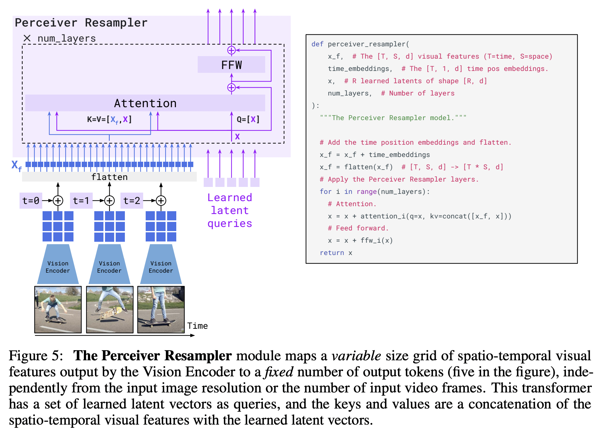

#  Simple Flamingo 


This is a simplified reimplementation of the Flamingo model [Flamingo Paper](https://arxiv.org/pdf/2204.14198), focused on single GPU training with smaller datasets for educational purposes. The goal is to understand the core mechanics without the complexity of distributed training.

Inspired by:
- [Open Flamingo](https://github.com/mlfoundations/open_flamingo) -Completely based on this
- [Mini Flamingo](https://github.com/dhansmair/flamingo-mini/) - Another good implemntation

## Model Architecture

<p align="center">
  
</p>

## Model Workflow

### Vision Components and workflow
- **Vision Encoder**: CLIP ViT-L-14
- **Perceiver Resampler**: height="250"

<p align="center">
  
</p>


```python
# Vision Encoding
input_image = (2, 1, 1, 3, 224, 224)

# Input Shape (B=2, T_img=1, F=1, C=3, H=224, W=224)
#  - B: batch size
#  - T_img: temporal dimension
#  - F: frames
#  - C: channels
#xs  - H/W: height/width

vision_features = vision_encoder(input_image)  # CLIP ViT-L-14
# Output shape: (2, 256, 1024)  # (batch, sequence_length, hidden_dim)

# Reshape for perceiver
vision_x = rearrange(vision_x, "(b T F) v d -> b T F v d", b=b, T=T, F=F)
# Shape: (2, 1, 1, 256, 1024)

# PerceiverResampler converts variable-length visual features to fixed length
perceiver_output = perceiver(vision_features)
# Output shape: (2, 1, 64, 1024)  # (batch, temporal, num_latents, dim)
```

**Perceiver Resampler Module**

``` python
def perceiver_resampler(
    x_f,                # Shape: [1, 224*224, 1024] - Visual features
    time_embeddings,    # Shape: [1, 1, 1024] - Time position embeddings
    x,                  # Shape: [64, 1024] - Learned latents (R=64)
    num_layers,         # Number of layers (scalar)
):


    # Add time embeddings
    # x_f: [1, 224*224, 1024] + time_embeddings: [1, 1, 1024] (broadcast)
    # [1, 224*224, 1024]
    x_f = x_f + time_embeddings
    
    # Flatten
    # [1, 224*224, 1024] -> [50176, 1024] (where 50176 = 1 * 224 * 224)
    x_f = flatten(x_f)

    for i in range(num_layers):
        # Attention step
        # x shape: [64, 1024] (64 queries)
        # concat([x_f, x]) shape: [50240, 1024] (keys/values) (50240 = 50176 + 64)
        # attention_output shape: [64, 1024]
        # x + attention_output shape: [64, 1024]
        x = x + attention_i(q=x, kv=concat([x_f, x]))
        
        # Feed forward step
        # Input shape: [64, 1024]
        # ffw_output shape: [64, 1024]
        # x + ffw_output shape: [64, 1024]
        x = x + ffw_i(x)
    
    # output shape: [64, 1024]
    return x
```


### Language Components and workflow

- **Language Model**: OPT-125m
- **Tokenizer**: OPT-125m tokenizer with special tokens:
  - `<|endofchunk|>`: Marks end of image-text pairs
  - `<image>`: Marks image positions in text

The OPT-125m language model is modified with:

1. GatedCrossAttention layers before every transformer decoder layer
2. Flamingo layer wrapping of original decoder layers

```python
# 1. Initialize base language model
lang_encoder = AutoModelForCausalLM.from_pretrained('opt-125m')


## Below initialization will convert any language decoder model or which has decoder layers to flamingo layers it does this by adding gattedcross attention before each transformer layer
# Original LM structure:
#TransformerLayer1 -> TransformerLayer2 -> TransformerLayer3 -> ...

# After Flamingo modification (decoder layers only):
#FlamingoLayer(
#    GatedCrossAttention
#    TransformerLayer1,
#) -> 
#FlamingoLayer(
#    GatedCrossAttention,
#    TransformerLayer2, 
#) -> 
#FlamingoLayer(
#    GatedCrossAttention,
#    TransformerLayer3,
#) -> ...

# 2. Add Flamingo capabilities
extend_instance(lang_encoder, FlamingoLMMixin)

# 3. Create Flamingo model
model = Flamingo(
    vision_encoder=vision_encoder,
    lang_encoder=lang_encoder,

)


```


```python
# Input Processing
#inputs_ids = [2x20]  # Initial input shape from tokenization
inputs_embeds = self.embed_tokens(input_ids)  # Shape: [2x20x768]
position_embedding = OPTLearnedPositionalEmbedding(2050, 768)

# For each decoder layer DO:
#1. Gated cross attention
#2. Normal decoder layer processing

lang_x = self.gated_cross_attn_layer(
    lang_x,
    self.vis_x,
    media_locations=self.media_locations,
    use_cached_media=self.use_cached_media,
)
lang_x = self.decoder_layer(lang_x, attention_mask=attention_mask)
```


### 4. Cross-Attention Mechanism

The gated cross-attention allows the model to only selectively attend to visual features or more accurately `<image>` tokens :

```python
def forward(self, x, media, media_locations):
    # Input shapes:
    # x: [B, T_txt, D_txt] = [1, 8, 1024]        # 8 text tokens
    # media: [B, T_img, n, D] = [1, 3, 64, 1024]  # 3 images, 64 tokens each
    # media_locations: [B, T_txt] = [1, 8]        # Binary mask for <image> positions

    # 1. Create Q, K, V
    q = self.to_q(x)                          # [1, 8, 512] (if heads=8, dim_head=64)
    media = rearrange(media, "b t n d -> b (t n) d")  # [1, 192, 1024]
    k, v = self.to_kv(media).chunk(2, dim=-1)  # Each: [1, 192, 512]

    # 2. Reshape for multi-head attention (h=8 heads)
    q = rearrange(q, "b n (h d) -> b h n d", h=h)     # [1, 8, 8, 64]
    k = rearrange(k, "b n (h d) -> b h n d", h=h)     # [1, 8, 192, 64]
    v = rearrange(v, "b n (h d) -> b h n d", h=h)     # [1, 8, 192, 64]

    # 3. Calculate attention scores and apply mask
    sim = einsum("... i d, ... j d -> ... i j", q, k)  # [1, 8, 8, 192]
    sim = sim.masked_fill(~text_to_media_mask, -inf)   # [1, 8, 8, 192]
    attn = sim.softmax(dim=-1)                         # [1, 8, 8, 192]

    # 4. Final output
    out = einsum("... i j, ... j d -> ... i d", attn, v)  # [1, 8, 8, 64]
    out = rearrange(out, "b h n d -> b n (h d)")          # [1, 8, 512]
```


- Text tokens only attend to valid media locations
- Example with media_locations = [1, 0, 0, 1, 0, 0]:
- text_time becomes [1, 1, 1, 2, 2, 2]
- media_time = [1, 2]
- First three tokens attend to first image
- Last three tokens attend to second image


### Loss 

Loss is standard shifted label cross entropy loss for autoregressive Language modelling

```python
    shift_logits = logits[..., :-1, :].contiguous()
    shift_labels = labels[..., 1:].contiguous()
    
    # Calculate cross entropy loss
    loss_fct = CrossEntropyLoss()
    loss = loss_fct(
        shift_logits.view(-1, self.config.vocab_size),
        shift_labels.view(-1)
    )
```
